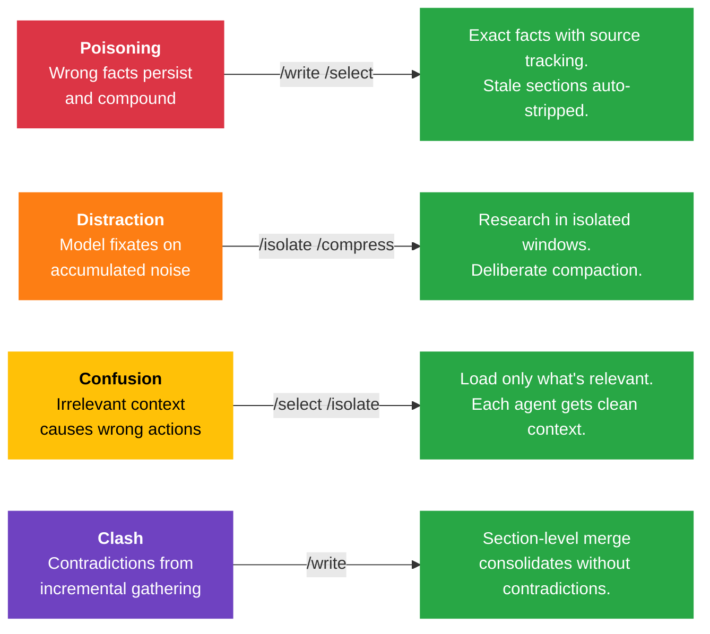
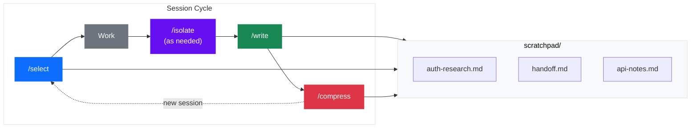

# WISCI

**Context Engineering Framework for AI Coding Agents**

[](LICENSE)
[]()
[](https://agentskills.io)
[](https://github.com/anthropics/claude-code)
[](https://github.com/google-gemini/gemini-cli)
[](https://github.com/openai/codex)

Ever notice your AI coding sessions get worse the longer they run? The model repeats itself, forgets what it just learned, or acts on information that's no longer true. That's not a bug — it's what happens when context fills up with noise.

WISCI gives you four slash commands — **Write**, **Isolate**, **Select**, **Compress** — that keep your AI coding sessions sharp. Save what matters, load only what's relevant, research without polluting your context, and hand off cleanly between sessions.

## Installation

WISCI skills use the [Agent Skills open standard](https://agentskills.io) (`SKILL.md` format), which is supported across all major AI coding agents.

<table>
<tr>
  <th width="200">Platform</th>
  <th>How to install</th>
</tr>
<tr>
  <td><strong>Claude Code</strong></td>
  <td><code>/plugin marketplace add ph3on1x/wisci</code><br><code>/plugin install wisci@wisci-framework</code></td>
</tr>
<tr>
  <td><strong>Gemini CLI</strong></td>
  <td><code>gemini extensions install &lt;github-url&gt;</code></td>
</tr>
<tr>
  <td><strong>Codex CLI</strong></td>
  <td>Clone the repo, then run <code>./scripts/setup-platforms.sh</code></td>
</tr>
<tr>
  <td><strong>Cursor</strong></td>
  <td>Auto-discovers skills — no setup needed if Claude Code plugin is installed. Otherwise, run <code>./scripts/setup-platforms.sh</code></td>
</tr>
</table>

> **Note:** `/isolate` uses subagent spawning, which works best on Claude Code and Codex CLI. On platforms without inline subagent support, research runs in a single agent — functional, but without parallel exploration.

## When to Use What

<table>
<tr>
  <th width="280">You're thinking...</th>
  <th width="280">Use</th>
  <th>What happens</th>
</tr>
<tr>
  <td>"I'll need this info tomorrow"</td>
  <td><code>/write auth-research</code></td>
  <td>Saves your findings to <code>scratchpad/auth-research.md</code> with file references that track staleness</td>
</tr>
<tr>
  <td>"I need to research something without cluttering my session"</td>
  <td><code>/isolate compare OAuth2 libraries for Node.js</code></td>
  <td>1-3 subagents handle it in isolated windows (websearch, docs, any task); results appear inline, your context stays clean</td>
</tr>
<tr>
  <td>"Where was I?"</td>
  <td><code>/select</code></td>
  <td>Loads a codebase overview + lists your saved context files, flagging any that are stale</td>
</tr>
<tr>
  <td>"I need my auth research back"</td>
  <td><code>/select auth-research</code></td>
  <td>Loads that specific context file, auto-stripping any sections whose source files have changed</td>
</tr>
<tr>
  <td>"Done for the day"</td>
  <td><code>/compress</code></td>
  <td>Creates a handoff document so your next session picks up exactly where you left off</td>
</tr>
<tr>
  <td>"Time to commit"</td>
  <td><code>/commit</code></td>
  <td>Creates a conventional commit with a <code>Context:</code> section that logs AI-layer changes — turning <code>git log</code> into long-term memory</td>
</tr>
</table>

## The Problem

LLM context windows fail in four predictable ways. WISCI gives you a command for each:



These failures are not edge cases — they are the default outcome of long-running sessions. Context quality degrades significantly past 40% utilization, yet most tools only react at 95% when auto-compaction kicks in. By then, the damage is done.

## How It Works



- **Topic-based storage** — Context lives in `scratchpad/` as markdown files organized by topic, preserving exact file paths, decisions, and reasoning.
- **Staleness detection** — Every scratchpad file includes a `## References` manifest. When loaded, git history is checked to detect whether referenced files have changed.
- **Section-level merge** — `/write` merges at `##` heading boundaries — stale sections are pruned automatically.
- **Auto-stripping** — `/select` removes stale content before loading. Outdated sections are stripped, broken references flagged.
- **Git as long-term memory** — `/commit` appends a `Context:` section to commits that logs changes to AI-layer files, making the context system's evolution queryable in `git log`.

Sessions are disposable but knowledge is not. Each cycle compounds what your project knows. The `scratchpad/` directory becomes a living knowledge base that survives session boundaries, context compactions, and team handoffs.

<details>
<summary><strong>Real-World Scenarios</strong></summary>

### Building a feature across multiple sessions

**Session 1 — Research and plan:**
```
> /select auth-layer
  (deep dive into auth middleware, token handling, session management — results appear inline)

> /isolate compare JWT vs session-based auth for our use case
  (subagents websearch best practices and read external docs — results inline, context stays clean)

> /write auth-research
  (saves findings to scratchpad/auth-research.md with exact file paths and line numbers)

> /compress
  (creates scratchpad/handoff.md: "Researched auth system. OAuth2 flow in src/auth/. Next: implement token refresh.")
```

**Session 2 — Implement:**
```
> /select
  (loads codebase overview, shows: auth-research.md [fresh], handoff.md [fresh])

> /select auth-research
  (loads your research — all file references still valid, nothing stripped)

  ... implement the feature ...

> /write auth-research
  (merges new implementation decisions into the existing file — section-level merge, no duplicates)

> /commit feat: add token refresh to auth middleware
  (commits with Context: section tracking scratchpad changes)
```

### Onboarding to an unfamiliar codebase

```
> /select
  (instant codebase overview: directory structure, tech stack, conventions, available context files)

> /select api-layer
  (deep dive into the API layer — subagents explore routes, handlers, and database connections)

> /isolate what are the best practices for testing Express middleware
  (subagents websearch and read external docs — results inline without polluting your context)

> /write onboarding-notes
  (persists everything — now any future session can /select onboarding-notes instead of re-exploring)
```

### Picking up a teammate's work

```
> /select
  (shows available context: payment-integration.md [stale — src/payments/handler.ts changed 2 days ago])

> /select payment-integration
  (loads the file with stale sections auto-stripped, adds note: "3 sections stripped. Consider /write to refresh.")

  ... review what's still valid, continue the work ...

> /write payment-integration
  (refreshes the file with current state — stale sections replaced, references updated)
```

</details>

## Acknowledgments

WISCI builds on foundational work in context engineering:

- **Lance Martin / LangChain** — The [WISC taxonomy](https://blog.langchain.com/context-engineering-for-agents/) (Write, Isolate, Select, Compress) that provides the structural foundation
- **Andrej Karpathy** — The [context engineering framing](https://x.com/karpathy/status/1937884699741483308) (LLM as CPU, context window as RAM, external storage as disk)
- **Drew Breunig** — The [four failure modes taxonomy](https://www.dbreunig.com/2025/05/22/context-engineering.html) (poisoning, distraction, confusion, clash)
- **Anthropic** — The [Claude Code](https://github.com/anthropics/claude-code) platform and [Agent Skills standard](https://agentskills.io) that make this possible

## License

[MIT](LICENSE)
